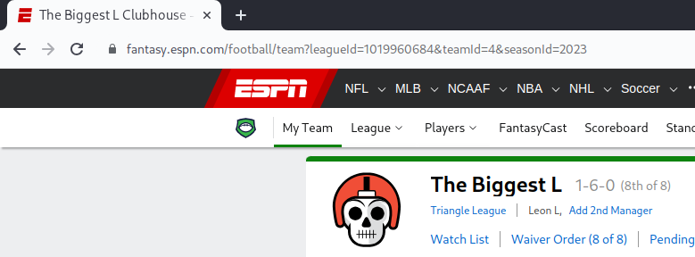

# FantasyTrader

[](https://github.com/Pop101/FantasyTrader/issues)

Become the greatest gamer known to man

# Table of Contents

- [FantasyTrader](#fantasytrader)
- [Table of Contents](#table-of-contents)
- [Overview](#overview)
- [Technologies](#technologies)
- [Getting Started](#getting-started)
  - [Finding your Information](#finding-your-information)
  - [Installation](#installation)
- [How it Works](#how-it-works)
- [Tweaking](#tweaking)

# Overview

Ever been too lazy to do your own research? Know nothing about football? This repo is for you! Never make a poor trade again with [FantasyTrader](https://github.com/Pop101/FantasyTrader) It will take in your league's scoring settings and your team's roster, and output the best trades you can make to maximize your points. It will also output the best players to pick up from the waiver wire.


# Technologies

This project is created with:

- [ESPN API](https://github.com/cwendt94/espn-api): 0.32.0
- [PyYAML](https://github.com/yaml/pyyaml): 6.0.1
- [anyascii](https://github.com/anyascii/anyascii): 0.3.2
- [lxml](https://lxml.de/): 4.9.3
- [cachetools](https://github.com/tkem/cachetools/): 5.3.1
- [levenshtein](https://github.com/maxbachmann/python-Levenshtein): 0.22.0
  
# Getting Started

First, edit the config file (```./config.yml```).

Some important settings to take note of is the maximum trade edge,
which will greatly influence the trades suggested by being more aggressive and willing to
rip people off. The higher it is, the less likely people will accept your trades as they will be worse off.

If you up the maximum trade size, the program will consider many more trades, including 2-for-1 trades.
This takes a very long time and is currently untested.

**If your league is private, you must set SWID and ESPN_S2**

## Finding your Information

**SWID and ESPN_S2**:

These cookies can be found in the storage of the browser.
There is [a browser extension](https://chrome.google.com/webstore/detail/espn-private-league-key-a/bakealnpgdijapoiibbgdbogehhmaopn), which is [open source](https://github.com/abinish/ESPNExtension). This is the easiest way to find these cookies.

If you prefer the hard way, there's a quick blurb how to do it [here](https://github.com/cwendt94/espn-api/discussions/150).

**League ID**:

You can find your league ID by logging into [ESPN](fantasy.espn.com) and navigating to your league.
The league ID will be in the browser's URL.



*This poor fellow's league id is 1019960684. He did not use this repo.*

**Team Name**:

You better know this one. Either way it's on the league page.
If you misspell it a little bit, it will still work. Don't worry, I can't spell aithur.

## Installation

Clone the Repo and ensure poetry is installed
```sh
git clone https://github.com/Pop101/SedOnline/issues
pip install poetry
```

Install the dependencies using poetry's version management
```sh
poetry install
```

Now you can run the applet itself.
```sh
poetry run python ./fantasytrader.py
```

All relevant output will be printed to the console, feel free to pipe it to a file for safekeeping.

# How it Works

The program will first fetch all the players in your league. It will also source predictions from [CSB Sports' Fantasy Rankings](https://www.cbssports.com/fantasy/football/rankings).

Using these, it will calculate a 'desireability score' for each player, as described in `modules/evaluator.py`. 

With all scores calculated, the program will check every possible trade with every other player. If a trade will be mutually beneficial, as defined by increasing a team's **linup's** total desireability, it will be saved.

Now, the program will greedily find a set of best trades from all mutually beneficial trades. It will do this by finding the trade with the highest total increase in desireability, and then removing all trades that involve either of the players in that trade. It will repeat this process until there are no more trades left.

Finally, the program will print out the best trades it found, as well as the best players to pick up from the waiver wire.

# Tweaking

It is very likely that the evaluator is very bad. It is currently very simple and does not take into account many factors. If you have any ideas on how to improve it, please open an issue or a pull request.

To try out different evaluators, make any change to `modules/evaluator.py` and rerun the program. It will automatically reload the evaluator and use the new one.

Helpful information: A player's information looks like this:
```json
{
    "name": "T. Hill",
    "rank": 0,
    "percentile": 0.0,
    "percentile_score": 0.0,
    "pos": "WR",
    "position": "WR",
    "proj_points": 23.9,
    "proj_season_points": 293.63
}
```

If you need to pull more player information, you can modify `modules/team_info.py` to do so.
